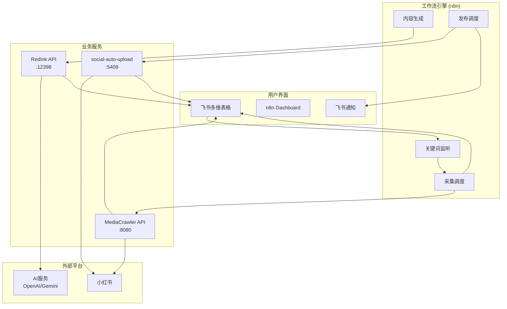
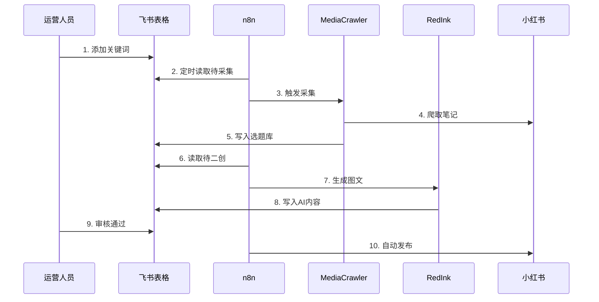
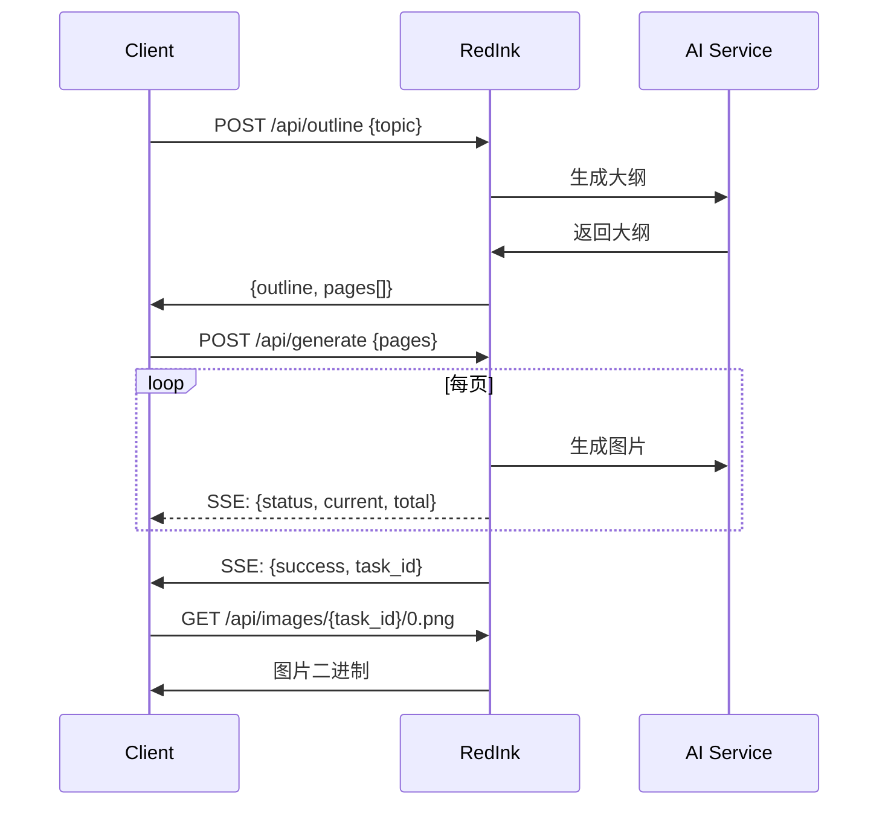
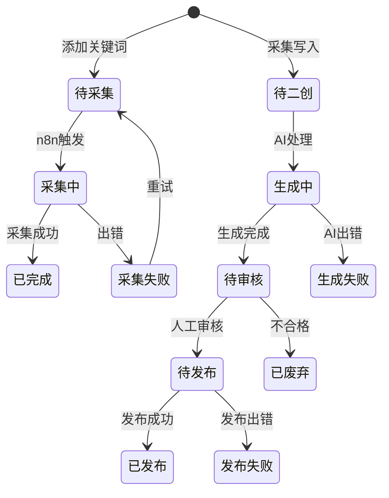

# 飞书 + n8n + 小红书 自动化运营系统

> **版本**: v3.0 (AI-Friendly)
> **更新**: 2025-12
> **适用**: Claude Code / Cursor / Copilot

---

## 快速参考 (AI Quick Reference)

```yaml
# 项目类型
type: 低代码自动化运营平台

# 核心技术栈
stack:
  workflow: n8n (5678)
  crawler: MediaCrawler API (8080)
  ai_content: RedInk (12398)
  publisher: social-auto-upload (5409)
  storage: 飞书多维表格

# 服务器
servers:
  tencent: 124.221.251.8    # 爬虫 API
  google: 136.110.80.154    # n8n 服务
  n8n_url: https://xhs.adpilot.club

# 关键目录
paths:
  patches: ./add_*.py, ./fix_*.py   # 爬虫补丁脚本
  scripts: ./scripts/               # 部署和工具脚本
  n8n: ./n8n/                       # n8n 工作流配置
  docs: ./docs/                     # 文档
```

---

## AI 开发指南

### 修改代码前必读

1. **爬虫 API 修改**: 修改 `mediacrawler-api/` 后需要重新构建 Docker 镜像
2. **n8n 工作流**: 使用 `scripts/create_*.py` 脚本创建，不要手动编辑 JSON
3. **飞书集成**: 凭证在 `.mcp.json`，表格 ID 在 `.env`
4. **补丁脚本**: `add_*.py` 添加功能，`fix_*.py` 修复 bug

### 常用命令

```bash
# 爬虫 API 测试
curl -X POST "http://124.221.251.8:8080/api/search/human" \
  -H "X-API-Key: dev-key" \
  -d '{"keyword":"美食","limit":5}'

# n8n 健康检查
curl https://xhs.adpilot.club/healthz

# 飞书表格读取 (需要 token)
python scripts/lark_client.py

# 部署 RedInk
bash scripts/deploy_redink_remote.sh
```

### 不要做的事

- 不要直接修改容器内文件，使用补丁脚本
- 不要在 `.mcp.json` 提交敏感凭证
- 不要跳过测试直接部署
- 不要修改 n8n 工作流 JSON，使用脚本生成

---

## 系统架构

### 架构图



### 数据流



---

## 目录结构

```
D:\project\XHS\
├── .claude/
│   └── skills/              # n8n-skills (7个模块)
├── .mcp.json                # MCP 配置 (含飞书凭证, 勿提交)
├── .mcp.json.example        # MCP 配置模板
├── .env                     # 环境变量
│
├── docs/
│   ├── 飞书+n8n+小红书自动化运营系统架构文档.md  # 本文档
│   └── REFACTORING_PLAN_v4.0.md
│
├── scripts/
│   ├── lark_client.py       # 飞书 API 客户端 (432行)
│   ├── create_*.py          # n8n 工作流生成脚本
│   ├── deploy_*.sh          # 部署脚本
│   └── setup_redink.sh      # RedInk 安装脚本
│
├── mediacrawler-api/        # 爬虫 API 源码
│   ├── main.py              # FastAPI 主入口
│   └── xhs_client.py        # 小红书客户端
│
├── n8n/                     # n8n 配置
│
├── add_*.py                 # 爬虫功能补丁 (添加)
├── fix_*.py                 # 爬虫功能补丁 (修复)
│
└── docker-compose.yml       # Docker 编排
```

---

## 核心组件

### 1. 爬虫 API (MediaCrawler)

| 属性 | 值 |
|------|-----|
| 服务器 | 124.221.251.8:8080 |
| 镜像 | media-crawler-api:v16 |
| 认证 | `X-API-Key: dev-key` |

**可用端点:**

| 端点 | 方法 | 状态 | 说明 |
|------|------|------|------|
| `/api/health` | GET | ✅ | 健康检查 |
| `/api/login/status` | GET | ✅ | 登录状态 |
| `/api/search/human` | POST | ✅ | 人工模拟搜索 (绕过-104) |
| `/api/creator/{id}` | GET | ✅ | 创作者信息 |
| `/api/note/detail` | POST | ⚠️ | 笔记详情 (平台限制) |
| `/api/crawler/cookies` | POST | ✅ | 设置 Cookie |

**请求示例:**

```bash
# 人工搜索
curl -X POST "http://124.221.251.8:8080/api/search/human" \
  -H "X-API-Key: dev-key" \
  -H "Content-Type: application/json" \
  -d '{"keyword": "穿搭", "limit": 5}'

# 设置 Cookie
curl -X POST "http://124.221.251.8:8080/api/crawler/cookies" \
  -H "X-API-Key: dev-key" \
  -d '{
    "cookies": [
      {"name":"web_session","value":"xxx","domain":".xiaohongshu.com","path":"/"}
    ]
  }'
```

### 2. n8n 工作流引擎

| 属性 | 值 |
|------|-----|
| 服务器 | 136.110.80.154:5678 |
| URL | https://xhs.adpilot.club |
| 进程 | systemd (debian用户) |

**飞书节点 (n8n-nodes-feishu-lite):**

```javascript
// 查询记录
{
  "operation": "bitable:table:record:query",
  "app_token": "{{$env.LARK_APP_TOKEN}}",
  "table_id": "tblXXX",
  "filter": {
    "conditions": [{"field_name": "status", "operator": "is", "value": ["待采集"]}]
  }
}

// 更新记录
{
  "operation": "bitable:table:record:update",
  "record_id": "{{$json.record_id}}",
  "fields": {"status": "采集中"}
}
```

### 3. RedInk (AI 内容生成)

| 属性 | 值 |
|------|-----|
| 端口 | 12398 |
| 功能 | 生成小红书风格图文 |

**API 流程:**



### 4. 飞书多维表格

**表格 ID (从 .env 读取):**

```yaml
LARK_APP_TOKEN: Gq93bAlZ7aSSclsLKdTcYCO2nwh
LARK_COOKIE_TABLE_ID: tblYa2d2a5lypzqz      # Cookie 表
TOPICS_TABLE_ID: tblE2SypBdIhJVrR           # 选题库
SOURCE_TABLE_ID: tblPCp5gqgVFnhLc           # 素材库
CONTENT_TABLE_ID: tblMYjwzOkYpW4AX          # 内容库
PUBLISH_TABLE_ID: tblp3iSuo0dasTtg          # 发布库
```

**LarkClient 使用:**

```python
from scripts.lark_client import LarkClient

client = LarkClient()

# 查询记录
records = client.query_records("tblXXX", filter="status='待采集'")

# 创建记录
client.create_record("tblXXX", {"title": "新笔记", "status": "待处理"})

# 批量更新
client.batch_update("tblXXX", [
    {"record_id": "rec1", "fields": {"status": "完成"}},
    {"record_id": "rec2", "fields": {"status": "完成"}}
])
```

---

## 数据模型

### 状态流转图



### 关键词库 (Keywords)

```typescript
interface Keyword {
  keyword: string;           // 搜索关键词
  category: '美妆' | '穿搭' | '美食' | '生活';
  priority: '高' | '中' | '低';
  status: '待采集' | '采集中' | '已完成' | '暂停';
  min_likes: number;         // 最低点赞数
  crawl_limit: number;       // 采集数量上限
  last_crawl_time: Date;
}
```

### 选题库 (Topics)

```typescript
interface Topic {
  keyword_id: string;        // 关联关键词
  note_id: string;           // 原笔记ID
  title: string;
  content: string;
  likes: number;
  collects: number;
  comments: number;
  note_url: string;
  note_type: '图文' | '视频';
  status: '待二创' | '生成中' | '待审核' | '待发布' | '已发布' | '已废弃';

  // AI 生成内容
  ai_title?: string;
  ai_content?: string;
  ai_images?: string[];      // 图片URL数组
  ai_outline?: string;
}
```

---

## 工作流配置

### 工作流矩阵

| 工作流 | 触发 | 输入 | 输出 | 脚本 |
|--------|------|------|------|------|
| 关键词监听 | 每小时 | 飞书(待采集) | 触发采集 | - |
| 爆款采集 | 被调用 | keyword | 飞书(选题) | - |
| AI内容生成 | 每4小时 | 飞书(待二创) | 飞书(图文) | `create_feishu_redink_final.py` |
| 自动发布 | 每日 | 飞书(待发布) | 发布结果 | - |
| 异常告警 | 错误 | 错误信息 | 飞书通知 | - |

### n8n 工作流模式

**模式A: 定时轮询**
```
Schedule → 查询飞书(status=X) → IF有数据 → 处理 → 更新状态
```

**模式B: SSE 流式处理 (RedInk)**
```
Trigger → 调用/api/outline → 调用/api/generate →
循环读取SSE → 下载图片 → 上传飞书 → 更新记录
```

**模式C: 错误处理**
```
Error Trigger → 格式化错误 → 飞书机器人通知
```

---

## 部署指南

### Docker Compose

```yaml
version: '3.8'
services:
  n8n:
    image: n8nio/n8n
    ports: ["5678:5678"]
    environment:
      - N8N_BASIC_AUTH_ACTIVE=true
    volumes:
      - n8n_data:/home/node/.n8n

  mediacrawler:
    image: media-crawler-api:v16
    ports: ["8080:8080"]
    environment:
      - API_KEY=dev-key
      - HEADLESS=true
    volumes:
      - ./browser_data:/app/browser_data

  redink:
    image: redink:latest
    ports: ["12398:12398"]
    environment:
      - OPENAI_API_KEY=${OPENAI_API_KEY}
```

### 部署命令

```bash
# 本地开发
docker-compose up -d

# 远程部署 RedInk
bash scripts/deploy_redink_remote.sh

# 应用爬虫补丁
docker cp fix_note_detail.py media-crawler-api:/tmp/
docker exec media-crawler-api python3 /tmp/fix_note_detail.py
docker restart media-crawler-api
```

---

## 错误处理

### 常见错误

| 错误 | 原因 | 解决方案 |
|------|------|----------|
| `-104 权限错误` | 小红书搜索API限制 | 使用 `/api/search/human` 人工搜索 |
| `TypeError: xsec_source` | API参数不匹配 | 运行 `fix_note_detail.py` |
| `Cookie 过期` | 登录失效 | 更新飞书Cookie表，调用 `/api/crawler/cookies` |
| `502 Bad Gateway` | Caddy代理配置错误 | 检查 `/opt/n8n/Caddyfile` |

### 重试策略

```yaml
default:
  max_retries: 3
  interval: 5s

crawl:
  max_retries: 2
  interval: 30s
  on_failure: 标记失败

publish:
  max_retries: 1
  on_failure: 人工处理
```

---

## 扩展配置

### MCP 服务器 (.mcp.json)

```json
{
  "mcpServers": {
    "n8n-mcp": {
      "command": "npx",
      "args": ["-y", "@leonardsellem/n8n-mcp-server"]
    },
    "lark": {
      "command": "npx",
      "args": ["-y", "@larksuiteoapi/lark-mcp"],
      "env": {
        "LARK_APP_ID": "cli_xxx",
        "LARK_APP_SECRET": "xxx",
        "LARK_APP_TOKEN": "xxx"
      }
    }
  }
}
```

### 环境变量 (.env)

```bash
# 飞书
LARK_APP_ID=cli_a98f34e454ba100c
LARK_APP_SECRET=xxx
LARK_APP_TOKEN=Gq93bAlZ7aSSclsLKdTcYCO2nwh

# AI 服务
OPENAI_API_KEY=sk-xxx
GEMINI_API_KEY=xxx

# 服务地址
MEDIACRAWLER_URL=http://124.221.251.8:8080
N8N_URL=https://xhs.adpilot.club
```

---

## 参考资源

| 项目 | 仓库 | 说明 |
|------|------|------|
| n8n | [n8n-io/n8n](https://github.com/n8n-io/n8n) | 工作流引擎 |
| n8n-nodes-feishu-lite | [other-blowsnow/n8n-nodes-feishu-lite](https://github.com/other-blowsnow/n8n-nodes-feishu-lite) | 飞书节点 |
| MediaCrawler | [NanmiCoder/MediaCrawler](https://github.com/NanmiCoder/MediaCrawler) | 小红书爬虫 |
| RedInk | [HisMax/RedInk](https://github.com/HisMax/RedInk) | AI图文生成 |
| social-auto-upload | [dreammis/social-auto-upload](https://github.com/dreammis/social-auto-upload) | 自动发布 |

---

*文档版本: v3.0 | AI-Friendly Format | 2025-12*
